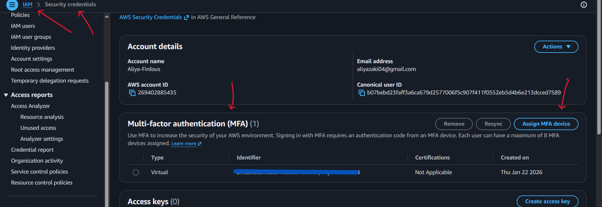
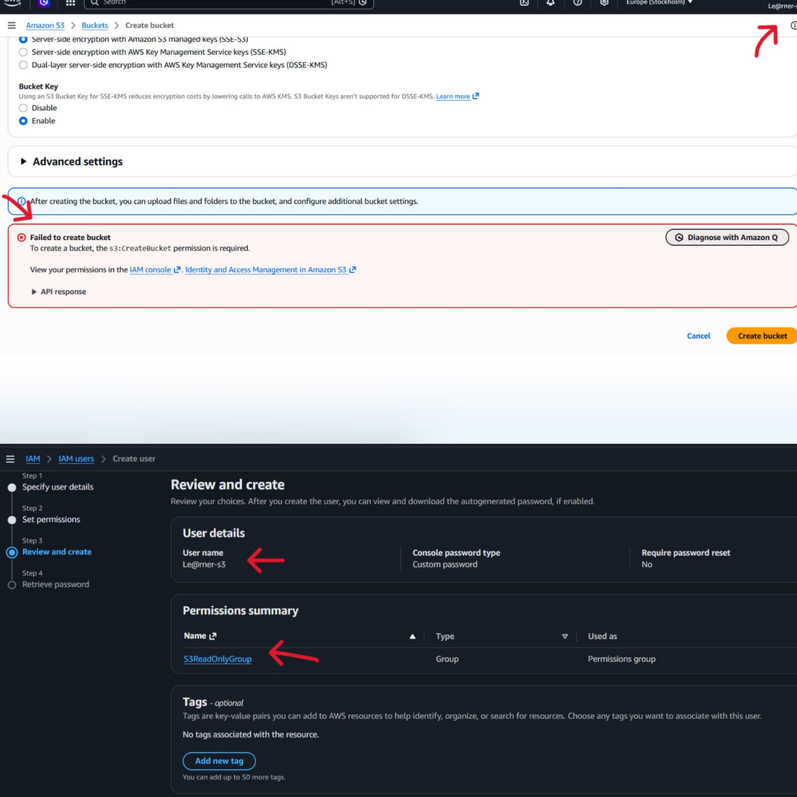
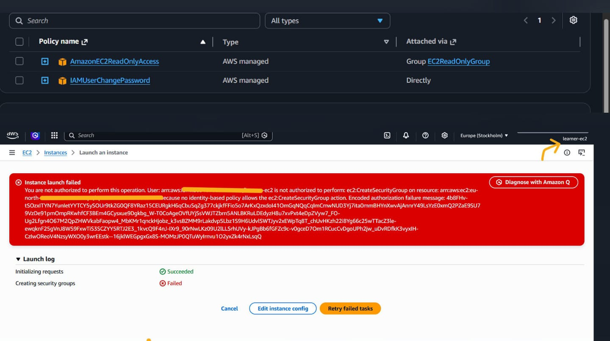
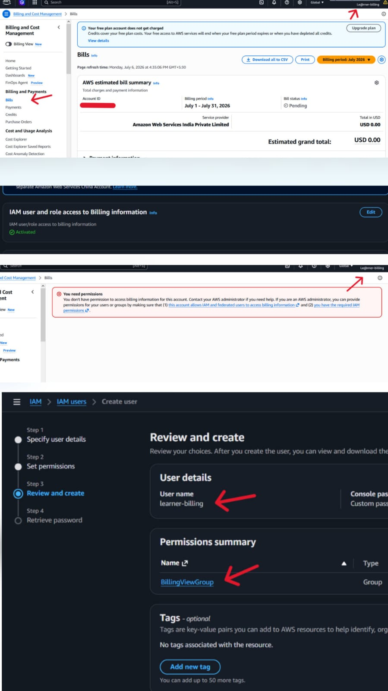
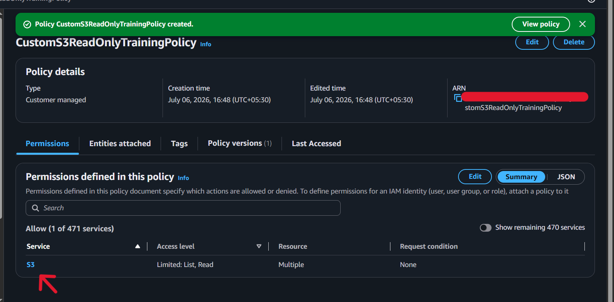
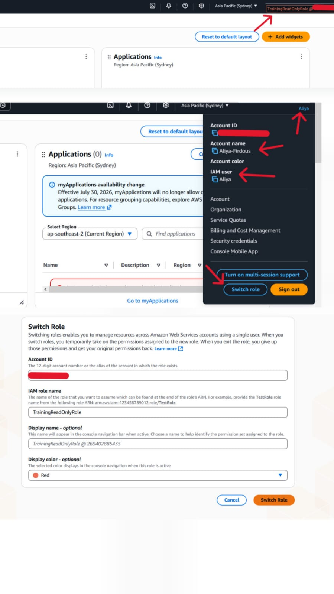
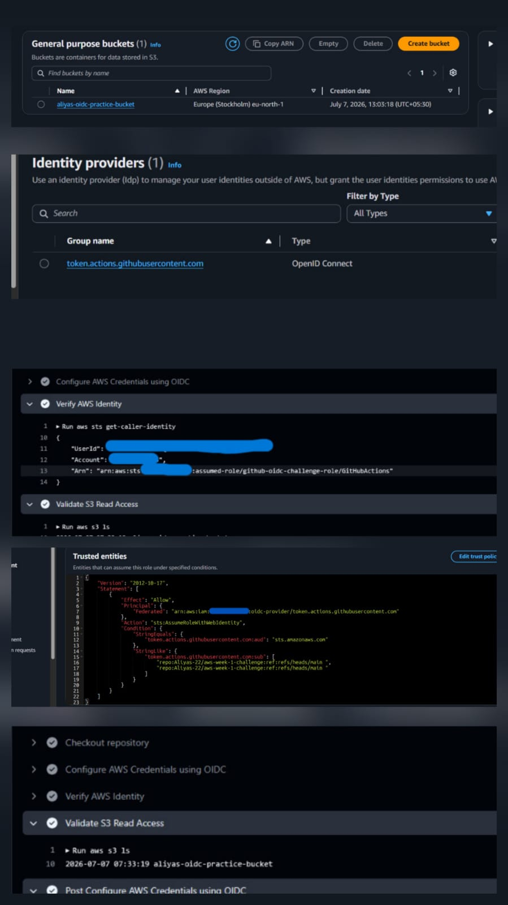

# Week 1 Submission - Shaikh Aliya

## Name
Shaikh Aliya
---

## Topics Practiced
- AWS account security
- Root MFA
- Billing alert
- IAM users
- IAM groups
- IAM roles and OIDC-based temporary access
- IAM policies
- JSON policy
- Least privilege
- Permission boundaries
- GitHub OIDC role for AWS access
- GitHub OIDC with AWS

---
## What I Learned
---

### Setting up a Billing Alarm
    
+ After creating my AWS account, the first thing I did was set up a billing alarm to monitor my future costs.
+ I configured AWS Budgets/CloudWatch to send an email notification to my registered email address whenever my AWS charges exceed a threshold of $5.
+ This helps me stay aware of unexpected costs and avoid surprise bills.


---

### Enabling Multi-Factor Authentication (MFA)

+ I also learned how to enable Multi-Factor Authentication (MFA) on my AWS root account as an extra layer of security.
+ MFA ensures that even if someone gets access to my login credentials, they still cannot access my AWS account without the one-time code generated by my authenticator app.
+ used the Google Authenticator app on my Android phone to set this up.
+ Now, after entering my username and password, AWS also requires this time-based code before granting access making my account much more secure.


---

## Screenshots Added
- Root MFA
- Billing alert
- IAM user
- IAM group
- Policy attached
- S3 access test
- IAM role
- GitHub OIDC role
- GitHub Actions OIDC workflow success

---
Goal: Understand IAM group-based access (groups, users, and permissions).
### Introduction to IAM
   
+ IAM (Identity and Access Management) is an AWS service used to control who can access what within an AWS account. It allows the account owner (root user) to grant specific permissions to users, allowing them to access only the services and actions they're authorized for.
  
### Creating IAM Users

+ I learned that creating an IAM user sets up a permanent identity with its own credentials, which can be granted specific permissions to access AWS services.
  
### Using IAM Groups
   
+ Instead of assigning permissions to each user individually, I learned that IAM Groups allow you to attach a policy once to a group and add multiple users to it.
+ This makes managing permissions for many users much easier and more consistent.
  
### Principle of Least Privilege
   
+ I learned the importance of the principle of least privilege — granting users only the minimum permissions they need to perform their tasks, and nothing more.
  
### Hands-on Practice
   
+ I created a group and applied a policy to it:
```json
Group Name: S3ReadOnlyGroup
Policy Attached: AmazonS3ReadOnlyAccess
User Created: learner-s3
Action: Added learner-s3 to S3ReadOnlyGroup
```

+ When I logged in as learner-s3, I could view S3 buckets but could not create new ones — confirming that the read-only policy was correctly enforced.
  


---

### Hands-on Practice — EC2 Read-Only Access
   
+ I repeated the same group-based access exercise using EC2 concept:
```json

Group Name: EC2ReadOnlyGroup
Policy Attached: AmazonEC2ReadOnlyAccess
User Created: learner-ec2
Action: Added learner-ec2 to EC2ReadOnlyGroup
```
+ When I logged in as learner-ec2, I could view running EC2 instances but could not create or terminate any instances
+ confirming that the read-only policy correctly restricted write/modify actions while still allowing visibility.



---
### Hands-on Practice — Billing Read-Only Access
    
Goal: Understand billing access with limited permissions.
```json

Group Name: BillingViewGroup
Policy Attached: AWSBillingReadOnlyAccess
User Created: learner-billing
Action: Added learner-billing to BillingViewGroup
```

+ After setting up the group, policy, and user, I initially couldn't access billing information even with the correct IAM policy attached
+ I kept getting a permissions error. After debugging, I discovered that by default,
+ AWS blocks IAM users from accessing billing data unless the root user explicitly enables it.
+ This setting is found under the root account's "IAM User and Role Access to Billing Information" option in the Billing preferences.
+ Once I enabled this setting as the root user, the learner-billing user was able to view billing information as expected,
+ confirming that IAM permissions alone aren't enough for billing access — account-level billing access must also be turned on by the root user first.



---

### Hands-on Practice — Writing a Custom IAM Policy (JSON)

+ Instead of using an AWS-managed policy, I created my own custom IAM policy using JSON to gain more precise control over permissions.
 ```json
Policy Name: CustomS3ReadOnlyTrainingPolicy
Bucket Used: aliyas-22-bucket
```
[custom-s3-readonly-policy.json](policies/custom-s3-readonly-policy.json)



<Summary>meaning of Json file used words </Summary>
    
+ s3:ListAllMyBuckets and s3:GetBucketLocation — lets the user view the list of all buckets and their region
  
+ s3:ListBucket — lets the user view contents (object list) of the specific bucket aliyas-22-bucket
  
+ s3:GetObject — lets the user download/view objects inside that bucket

+ Using this custom policy, I was able to view the bucket and retrieve objects from it, but I could not create new buckets or upload/delete objects — confirming that the policy was scoped exactly as intended.

---

### Understand role assumption and temporary access.

+ Switch Role is a feature in the AWS Management Console that lets an IAM user temporarily assume the permissions of an IAM Role, without logging out and logging back in with different credentials.
+ When you switch roles, AWS's STS (Security Token Service) issues you temporary security credentials tied to that role's permissions.
+ These credentials are short-lived (they expire automatically, usually within an hour by default,
+ though this is configurable), after which you'd need to switch again if you still need that access.

 ## why we use it??
 
 > To avoid giving users permanent access to sensitive resources they only occasionally need.
 > To allow cross-account access — for example, an employee at Company A can switch into a role in Company B's AWS account (if trust is configured) without needing a separate login for that account.
 > To support the security best practice of least privilege + temporary, auditable access rather than long-lived broad permissions.


 

 ---

### I configured GitHub Actions to authenticate with AWS using OpenID Connect (OIDC) instead of storing long-lived AWS access keys as GitHub Secrets. How it works:

+ GitHub Actions requests a signed OIDC token for the workflow run.
  
+ AWS IAM's OIDC Identity Provider validates this token against the configured trust policy (which restricts access to a specific GitHub repository).
  
+ If the token is valid, AWS STS uses AssumeRoleWithWebIdentity to issue temporary security credentials.

+ These temporary credentials are used to access AWS resources
  
+ (e.g., verifying identity with aws sts get-caller-identity, listing S3 buckets).

### Why OIDC is more secure:

**Storing permanent AWS access keys in GitHub Secrets creates risk — if leaked, they remain valid until manually rotated. OIDC removes this risk entirely by using short-lived, automatically expiring credentials generated fresh for every workflow run, tied specifically to my repository. This follows the AWS best practice of avoiding long-lived credentials in favor of temporary, scoped, and auditable access.**

 



## LinkedIn Post

https://www.linkedin.com/posts/shaikh-aliya22_10weeksofaws-10weeksofaws-aws10weekchallenge-ugcPost-7480241523914186752-jD3Q/?utm_source=social_share_send&utm_medium=member_desktop_web&rcm=ACoAAFTAa6kBnFsZizIFmvS4f21x6dmrZA1sPCY

