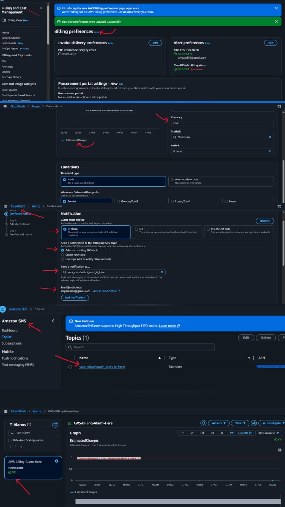

# Week 1 Day 2 — IAM Challenge
## Name
Shaikh Aliya Firdous
---

## Topics Practiced
- AWS account security
- Root MFA
- Billing alert
- IAM users
- IAM groups
- IAM roles and OIDC-based temporary access
- IAM policies
- JSON policy
- Least privilege
- Permission boundaries
- GitHub OIDC role for AWS access
- GitHub OIDC with AWS

---
## What I Learned

1. Setting up a Billing Alarm
    
+ After creating my AWS account, the first thing I did was set up a billing alarm to monitor my future costs.
+ I configured AWS Budgets/CloudWatch to send an email notification to my registered email address whenever my AWS charges exceed a threshold of $5.
+ This helps me stay aware of unexpected costs and avoid surprise bills.

---

2. Enabling Multi-Factor Authentication (MFA)

+ I also learned how to enable Multi-Factor Authentication (MFA) on my AWS root account as an extra layer of security.
+ MFA ensures that even if someone gets access to my login credentials, they still cannot access my AWS account without the one-time code generated by my authenticator app.
+ used the Google Authenticator app on my Android phone to set this up.
+ Now, after entering my username and password, AWS also requires this time-based code before granting access making my account much more secure.

---

## Screenshots Added
- Root MFA
- Billing alert
- IAM user
- IAM group
- Policy attached
- S3 access test
- IAM role
- GitHub OIDC role
- GitHub Actions OIDC workflow success

 
