## Week 1 Day 2 — IAM Challenge

---

**Sanket Dangat**

## Topics Practiced
- AWS account security
- Root MFA
- Billing alert
- IAM users
- IAM groups
- IAM roles and OIDC-based temporary access
- IAM policies
- JSON policy
- Least privilege
- Permission boundaries
- GitHub OIDC role for AWS access
- GitHub OIDC with AWS


## Lab 1 — Secure Your AWS Account

Goal: Create a safe AWS account foundation for the next 10 weeks.

Steps:

1. Create or log in to your AWS account.
2. Enable MFA on the root user.
3. Open the Billing Dashboard.
4. Turn on billing alerts / budget alerts.
5. Create an alert for estimated charges, for example `$5`.
6. Stop using root user for daily activities.

**Before creating an AWS Billing Alarm, make sure these prerequisites are completed:**

1. Enable Billing Alerts
- Sign in as the AWS account root user (or an IAM identity with the necessary billing permissions if supported).
- Open the Billing and Cost Management console.
- Go to Billing preferences.
- Enable Receive CloudWatch billing alerts.
- Save the changes.

2. Use the North Virginia(us-east-1) AWS Region
- Billing metrics are available only in US East (N. Virginia) (us-east-1).
- Create the alarm in this region.

Deliverables:

### Root MFA enabled


### Billing Alert


### Budget Alerts


- Why should the AWS root user not be used daily?
  - The root user has full access to the entire AWS account.
  - Using it every day is risky because one mistake can affect all resources.
  - If the root account is hacked, the attacker gets complete control of the AWS account.
  - For daily work, we should use IAM users or IAM roles with only the required permissions.
  - The root user should be used only for account setup and a few critical administrative tasks.
  - MFA should always be enabled on the root account for extra security.

  **Key Learning:** 
  - Learned AWS security best practices by enabling MFA for the root user
  - Configuring billing and budget alerts to monitor costs
  - Understanding why the root account should only be used for critical administrative tasks while IAM users or roles are used for daily operations.


---

## Lab 2 — S3 Read-Only IAM Group and User

Goal: Understand IAM group-based access.

Create group:

```text
Group name: S3ReadOnlyGroup
Policy: AmazonS3ReadOnlyAccess
```

Create user:

```text
User name: learner-s3
Add user to: S3ReadOnlyGroup
```

Test:

1. Log in as `learner-s3`.
2. Open S3.
3. Confirm you can view/list S3 buckets.
4. Try an action that is not allowed.
5. Observe `Access Denied`.

Deliverables:

### Group created & Policy Attached


### User Added to group
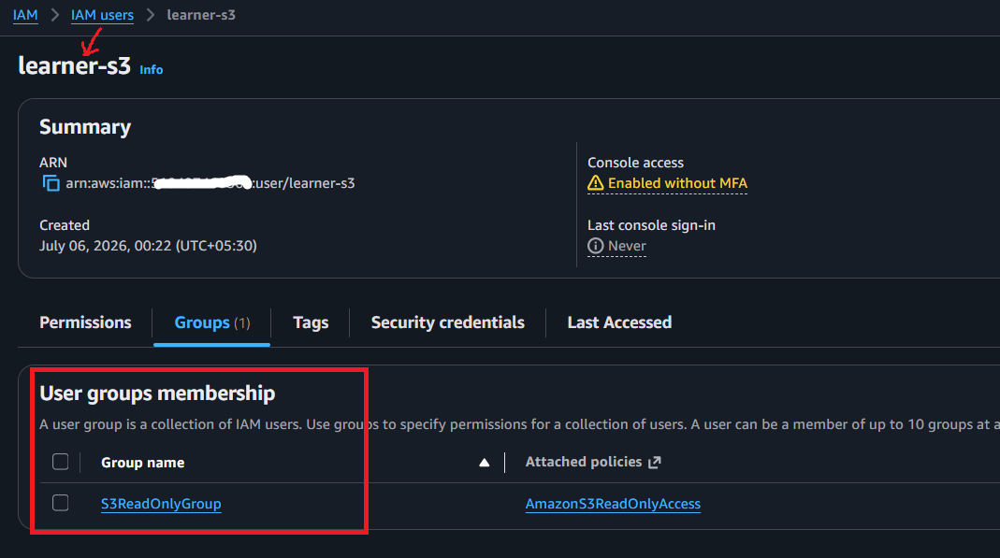

### Allowed S3 view action


### Denied Action


  **Key Learning** 
  - Learned how to create an IAM group and attach a managed policy.
  - Granted read-only access to Amazon S3 using group-based permissions.
  - Verified that users can view S3 resources but cannot modify or delete them.
  - Understood the principle of least privilege

---

## Lab 3 — EC2 Read-Only Access

Goal: Apply least privilege to EC2.

Create group:

```text
Group name: EC2ReadOnlyGroup
Policy: AmazonEC2ReadOnlyAccess
```

Create user:

```text
User name: learner-ec2
Add user to: EC2ReadOnlyGroup
```

Test:

1. Log in as `learner-ec2`.
2. Open EC2 dashboard.
3. Confirm EC2 resources are visible.
4. Confirm the user cannot create or terminate instances.

Deliverables:

### EC2ReadOnlyGroup & Policy attached
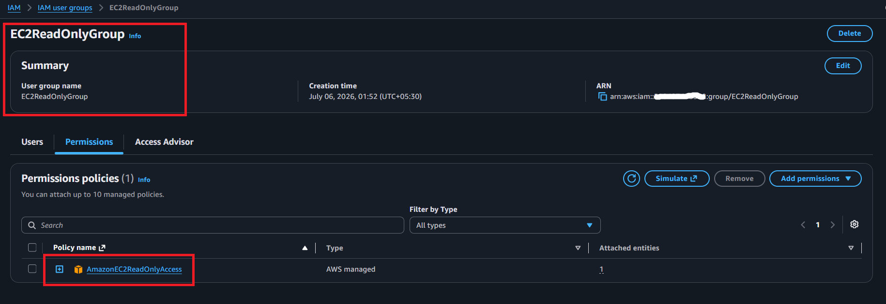

### User Added to group


### EC2 Dashboard access
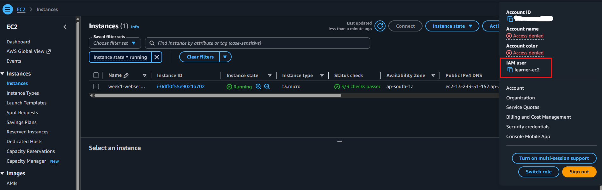

### Denied Terminate action


  **Key Learnings**
  - Created an IAM group with EC2 read-only permissions.
  - Verified that users can view EC2 resources without managing them.
  - Confirmed that instance creation, modification, and termination are denied.
  - Reinforced least-privilege access control.

---

## Lab 4 — Billing View Access

Goal: Understand billing access with limited permissions.

Create group:

```text
Group name: BillingViewGroup
Policy: AWSBillingReadOnlyAccess
```

Create user:

```text
User name: learner-billing
Add user to: BillingViewGroup
```

Test:

1. Log in as `learner-billing`.
2. Open Billing Dashboard.
3. Verify billing visibility.
4. Confirm user cannot manage unrelated AWS services.
 

Deliverables:

### BillingViewGroup & Policy attached


### Billing Dashboard access


### learner-billing user cannot manage unrelated AWS services
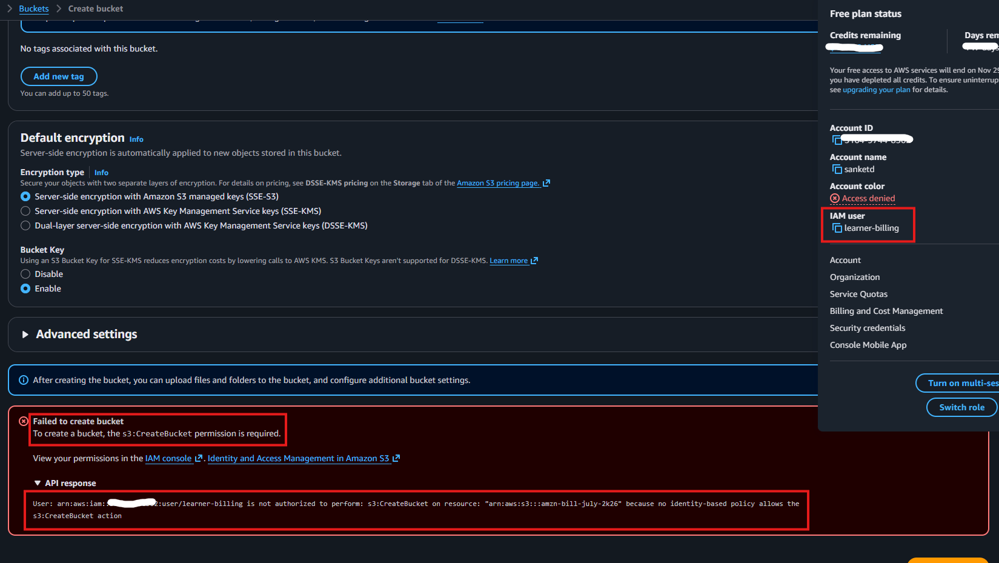

  **Key Learnings**
  - Configured read-only access to the AWS Billing Dashboard.
  - Allowed users to view billing information without administrative permissions.
  - Confirmed that access to unrelated AWS services is restricted.

---

## Lab 5 — Custom S3 Read-Only JSON Policy

Goal: Read and create a basic JSON policy.

Create a customer managed policy:

```text
Policy name: CustomS3ReadOnlyTrainingPolicy
```

```json
{
  "Version": "2012-10-17",
  "Statement": [
    {
      "Effect": "Allow",
      "Action": [
        "s3:ListAllMyBuckets",
        "s3:GetBucketLocation"
      ],
      "Resource": "*"
    },
    {
      "Effect": "Allow",
      "Action": [
        "s3:ListBucket"
      ],
      "Resource": "arn:aws:s3:::YOUR-BUCKET-NAME"
    },
    {
      "Effect": "Allow",
      "Action": [
        "s3:GetObject"
      ],
      "Resource": "arn:aws:s3:::YOUR-BUCKET-NAME/*"
    }
  ]
}
```

Deliverables:

### Custom S3 Policy
[CustomS3ReadOnlyTrainingPolicy](policies/CustomS3ReadOnlyTrainingPolicy.json)

### Custom Policy Created


### Policy Attached to learner-s3 user
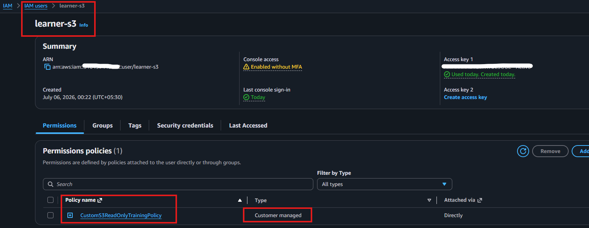

### Allowed action
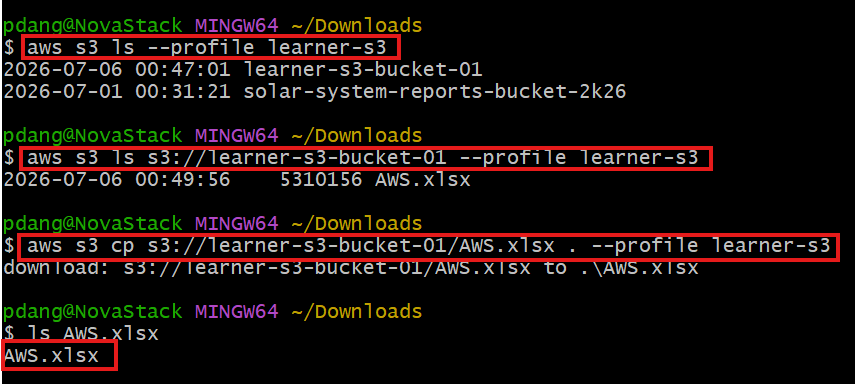
  - Successfully listed all S3 buckets
  - Successfully viewed objects in learner-s3-bucket-01.
  - Successfully downloaded AWS.xlsx 

### Denied action

  - Uploading a file (s3:PutObject) was denied due to insufficient permissions.
  - Deleting an object (s3:DeleteObject) was denied because the IAM policy does not allow this action.

  **Key Learnings**
  - Created a custom IAM policy using JSON.
  - Applied fine-grained permissions to a specific S3 bucket.
  - Allowed bucket listing, object viewing, and downloading only.
  - Verified that upload and delete operations are denied due to missing permissions

---

## Optional Advanced Lab — Switch Role

Goal: Understand role assumption and temporary access.

Create role:

```text
Role name: TrainingReadOnlyRole
Policy: ReadOnlyAccess
```

Create a policy for an IAM user that allows assuming this role:

```json
{
  "Version": "2012-10-17",
  "Statement": [
    {
      "Effect": "Allow",
      "Action": "sts:AssumeRole",
      "Resource": "arn:aws:iam::ACCOUNT-ID:role/TrainingReadOnlyRole"
    }
  ]
}
```

Replace:

```text
ACCOUNT-ID
```

with your AWS account ID.

Test:

1. Log in as IAM user.
2. Use Switch Role in AWS Console.
3. Switch into `TrainingReadOnlyRole`.
4. Verify role-based access.


Deliverables:

### TrainingReadOnlyRole with ReadOnlyAcess
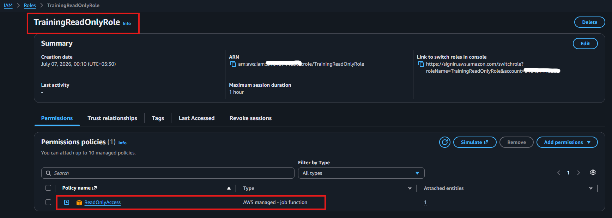

### IAM User Assume Role Policy Attached


### Login as IAM user(sanket)
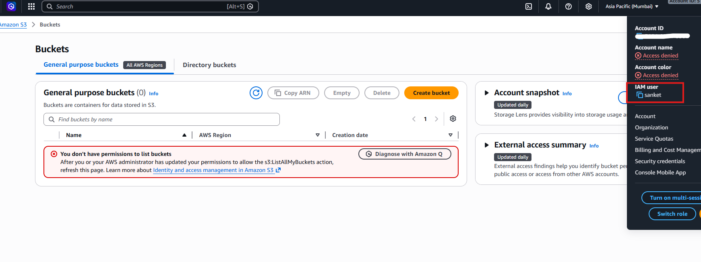

### Switch Role
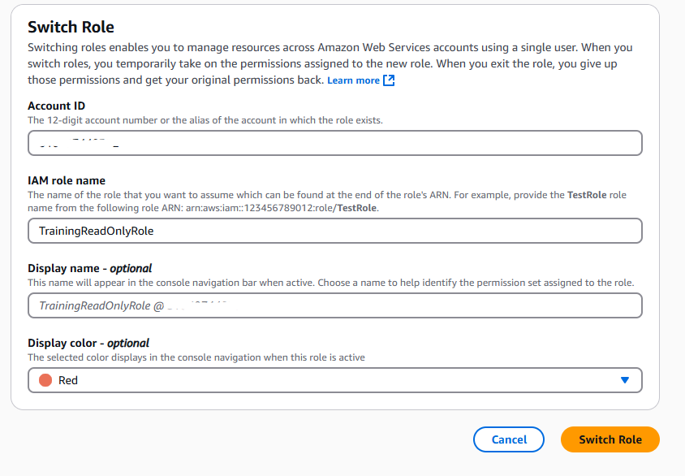

### Verify Role Acess
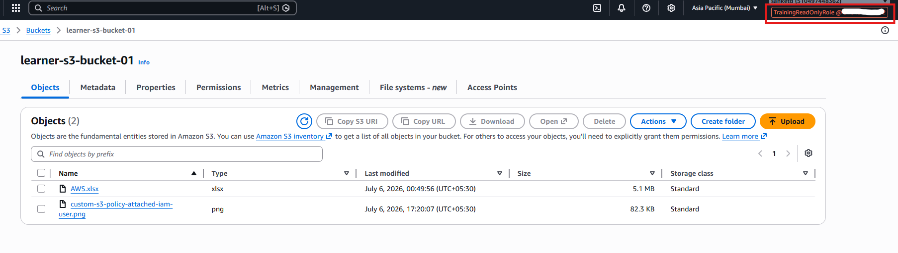

 **Key Learnings**
  - Created an IAM role with the ReadOnlyAccess managed policy.
  - Learned how to grant an IAM user permission to assume a role using the sts:AssumeRole action.
  - Used the Switch Role feature in the AWS Management Console to temporarily assume the TrainingReadOnlyRole.
  - Verified that the assumed role provided temporary read-only permissions based on the role's policy.
  - Understood that Switch Role enhances security by providing temporary, least-privilege access without sharing long-term credentials.
  - Learned that Switch Role simplifies permission management, supports secure cross-account access, and eliminates the need to create multiple IAM users for different permission levels.

---

## Optional Advanced Challenge — GitHub OIDC with AWS

Goal: Configure secure GitHub Actions access to AWS without storing long-lived AWS access keys in GitHub Secrets.

This challenge helps you understand how GitHub Actions can authenticate to AWS using OIDC, IAM, and AWS STS.

### Architecture

```text
GitHub Actions
      │
      │ OIDC Token
      ▼
AWS IAM OIDC Provider
      │
      ▼
AWS STS AssumeRoleWithWebIdentity
      │
Temporary Credentials
      ▼
AWS Resources such as S3 or EC2
```

### Step 1 — Create GitHub OIDC Provider in AWS

Open:

```text
AWS Console → IAM → Identity Providers → Add Provider
```

Provider type:

```text
OpenID Connect
```

Provider URL:

```text
https://token.actions.githubusercontent.com
```

Audience:

```text
sts.amazonaws.com
```

Click **Add Provider**.

### Step 2 — Create IAM Role for GitHub Actions

Go to:

```text
IAM → Roles → Create Role
```

Select:

```text
Trusted entity: Web Identity
Identity Provider: token.actions.githubusercontent.com
Audience: sts.amazonaws.com
```

Use your own GitHub details:

```text
GitHub organization or username: <YOUR_GITHUB_ORG_OR_USERNAME>
GitHub repository: <YOUR_REPOSITORY_NAME>
```

Example:

```text
GitHub organization or username: your-github-username
GitHub repository: aws-week-1-challenge
```

Role name:

```text
<YOUR_OIDC_ROLE_NAME>
```

Example:

```text
github-oidc-challenge-role
```

Attach a safe challenge permission such as:

```text
AmazonS3ReadOnlyAccess
```

Create the role.

### Step 3 — Update the Trust Policy

Replace the role trust relationship with the policy below.

Replace the placeholders with your own values:

```text
<YOUR_AWS_ACCOUNT_ID> = your AWS account ID
<YOUR_GITHUB_ORG_OR_USERNAME> = your GitHub username or organization
<YOUR_REPOSITORY_NAME> = your repository name
```

```json
{
  "Version": "2012-10-17",
  "Statement": [
    {
      "Effect": "Allow",
      "Principal": {
        "Federated": "arn:aws:iam::<YOUR_AWS_ACCOUNT_ID>:oidc-provider/token.actions.githubusercontent.com"
      },
      "Action": "sts:AssumeRoleWithWebIdentity",
      "Condition": {
        "StringEquals": {
          "token.actions.githubusercontent.com:aud": "sts.amazonaws.com"
        },
        "StringLike": {
          "token.actions.githubusercontent.com:sub": "repo:<YOUR_GITHUB_ORG_OR_USERNAME>/<YOUR_REPOSITORY_NAME>:*"
        }
      }
    }
  ]
}
```

Challenge note:

For stricter security, you can restrict the trust policy to a specific branch later, for example:

```text
repo:<YOUR_GITHUB_ORG_OR_USERNAME>/<YOUR_REPOSITORY_NAME>:ref:refs/heads/main
```

### Step 4 — Add GitHub Actions Workflow

Create this file in your repository:

```text
.github/workflows/aws-oidc-challenge.yml
```

Use this workflow:

```yaml
name: AWS OIDC Challenge

on:
  workflow_dispatch:

permissions:
  id-token: write
  contents: read

jobs:
  aws-oidc-challenge:
    runs-on: ubuntu-latest

    steps:
      - name: Checkout repository
        uses: actions/checkout@v4

      - name: Configure AWS Credentials using OIDC
        uses: aws-actions/configure-aws-credentials@v4
        with:
          role-to-assume: arn:aws:iam::<YOUR_AWS_ACCOUNT_ID>:role/<YOUR_OIDC_ROLE_NAME>
          aws-region: ap-south-1

      - name: Verify AWS Identity
        run: aws sts get-caller-identity

      - name: Validate S3 Read Access
        run: aws s3 ls
```

Replace the placeholders with your own values:

```text
<YOUR_AWS_ACCOUNT_ID> = your AWS account ID
<YOUR_OIDC_ROLE_NAME> = your IAM role name created for this challenge
```

### Step 5 — Run the Challenge

1. Push the workflow to GitHub.
2. Open the repository in GitHub.
3. Go to **Actions**.
4. Select **AWS OIDC Challenge**.
5. Click **Run workflow**.
6. Open the workflow logs.
7. Check the output of `aws sts get-caller-identity`.

Expected output should show an assumed-role ARN similar to:

```text
arn:aws:sts::<YOUR_AWS_ACCOUNT_ID>:assumed-role/<YOUR_OIDC_ROLE_NAME>/...
```

If you see an assumed-role ARN, your GitHub OIDC challenge is completed successfully.

Deliverables:

### OIDC Provider
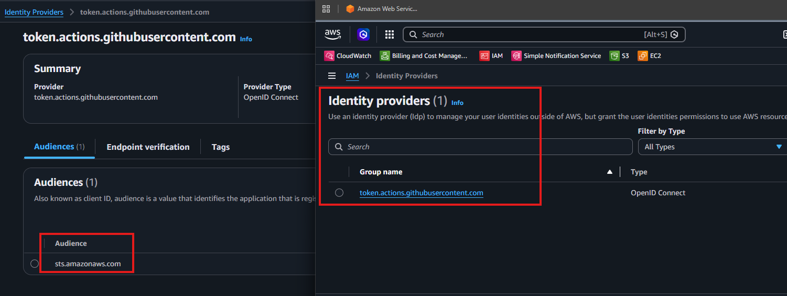

### IAM Role(github-oidc-challenge-role)
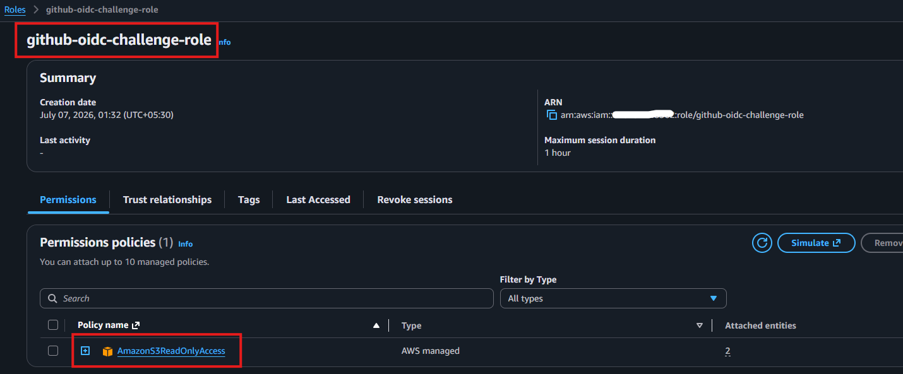

### OIDC Trust Policy


### Github Action Success


### STS Assumed Role Output


### Validate S3 Read Access


### GHA workflow
[Workflow](oidc/aws-oidc-challenge.yml)

  **Key Learnings**
  - Configured an AWS IAM OIDC Identity Provider to establish trust with GitHub Actions.
  - Created an IAM role that GitHub Actions can securely assume using OpenID Connect (OIDC).
  - Configured a trust policy to restrict role assumption to a specific GitHub repository.
  - Implemented GitHub Actions authentication using AWS STS AssumeRoleWithWebIdentity.
  - Verified successful role assumption by checking the STS assumed-role ARN in the workflow logs.
  - Validated secure access to AWS resources by listing S3 buckets with temporary credentials.
  - Learned that OIDC eliminates the need to store long-lived AWS access keys in GitHub Secrets, improving security and reducing credential management overhead.
  - Understood how temporary credentials issued by AWS STS provide secure, least-privilege access for CI/CD workflows.
---