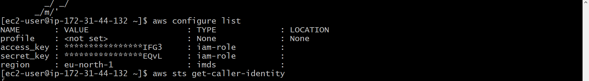
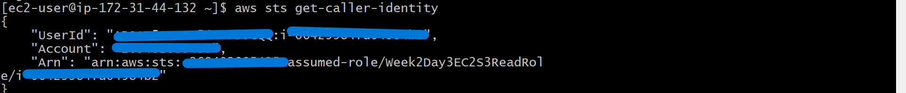
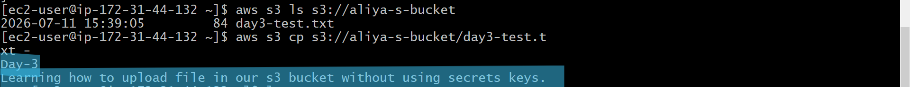
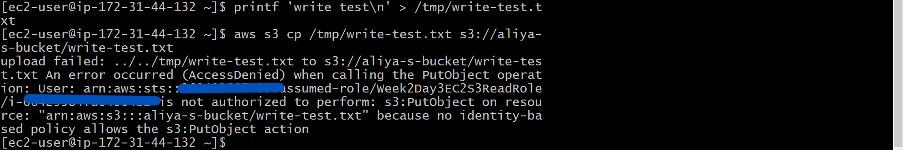

# Week 2 - Day 3: IAM Roles and STS

## Name
Shaikh Aliya 

## Topics Practiced
- Trust policy vs permission policy
- STS AssumeRole
- EC2 role and instance profile
- Cross-service role assumption
- Temporary credentials
- Least-privilege S3 access


---

# What I Built

In this practical, I created an S3 bucket and configured an IAM Role that allows an EC2 instance to securely access the bucket using temporary credentials generated by AWS STS.

---

# Step 1 - Created an S3 Bucket

First, I created an S3 bucket in that i uploaded the day3-test.txt file 

---

# Step 2 - Created an IAM Role

then created an IAM Role and selected **EC2** as the trusted entity.

This automatically created a **Trust Policy**, which allows only the EC2 service to assume this IAM Role.

Then I added an **Inline Policy** with the following permissions:

- `s3:ListBucket`
- `s3:GetObject`

This means the EC2 instance can:

- List the bucket
- Read objects from the bucket

But it cannot upload objects because I did not grant `s3:PutObject`.

### Screenshot



---

# Step 3 - Launched an EC2 Instance

While launching the EC2 instance, I selected the IAM Role that I created earlier.
I selected only the IAM Role, AWS automatically created and attached an **Instance Profile** in the background.

Actual flow:

```text
EC2 Instance
      │
Instance Profile
      │
IAM Role
```

---

# Step 4 - Verified the IAM Role

After connecting to the EC2 instance using SSH, I ran:

```bash
aws sts get-caller-identity
```

The command returned my Account ID, Role ARN and Role Name.

This confirmed that my EC2 instance successfully assumed the IAM Role.

### Screenshot



---

# Step 5 - Tested S3 Read Permission

I listed the available S3 buckets using the AWS CLI.
 my IAM Role had the required permissions (`s3:ListBucket`), the command executed successfully.

### Screenshot



---

# Step 6 - Tested S3 Write Permission

Next, I created a test file.

```bash
printf 'write test\n' > /tmp/write-test.txt
```

Then I tried uploading it.

```bash
aws s3 cp write-test.txt s3://aliya-s-bucket/
```

The upload failed with **AccessDenied**.

This happened because my IAM Role did not have the `s3:PutObject` permission.

### Screenshot



---

# What I Learned

## Trust Policy vs Permission Policy

Initially, I was confused between these two policies, but after completing this practical I understood their difference.

### Trust Policy

The Trust Policy answers:

> **Who can assume this IAM Role?**

In my practical, I selected **EC2** while creating the IAM Role.

Therefore, the Trust Policy allows only the EC2 service to assume the role.

It does **not** grant access to S3.

---

### Permission Policy

The Permission Policy answers:

> **What can the assumed role do?**

In my inline policy, I granted:

- `s3:ListBucket`
- `s3:GetObject`

So after EC2 assumes the role, it can:

- List the bucket
- Read objects

Since I didn't allow `s3:PutObject`, uploading files was denied.

---

# STS (Security Token Service)

I learned that AWS STS creates **temporary credentials** whenever the EC2 instance assumes the IAM Role.

Instead of storing permanent Access Keys, AWS automatically provides temporary credentials.

These credentials include:

- Access Key ID
- Secret Access Key
- Session Token
- Expiration Time

The AWS CLI automatically uses these credentials whenever I run AWS commands.

---

# EC2 Role and Instance Profile

Initially, I thought the IAM Role was directly attached to the EC2 instance.

After completing this practical, I learned that AWS automatically creates an **Instance Profile**.

The actual flow is:

```text
EC2
   │
Instance Profile
   │
IAM Role
```

The Instance Profile acts as a container that makes the IAM Role available to the EC2 instance.

---

# Cross-Service Role Assumption

In this practical, one AWS service accessed another AWS service securely.

Flow:

```text
EC2
   │
IAM Role
   │
STS Temporary Credentials
   │
S3 Bucket
```

This is called **Cross-Service Role Assumption**.

---

# Temporary Credentials

When I ran:

```bash
aws s3 ls
```

I never entered an Access Key or Secret Key.

Behind the scenes:

1. AWS CLI detected the IAM Role attached to EC2.
2. STS generated temporary credentials.
3. AWS CLI used those temporary credentials.
4. S3 checked the Permission Policy.
5. The request was allowed because the role had permission.

---

# Principle of Least Privilege

Instead of giving full access, I granted only the permissions required for my task.

Allowed:

- s3:ListBucket
- s3:GetObject

Not Allowed:

- s3:PutObject

This is called the **Principle of Least Privilege**, where we grant only the minimum permissions required.

---

# Behind the Scenes

```text
Create IAM Role
        │
        ▼
Trust Policy
(EC2 can assume the role)
        │
        ▼
Permission Policy
(ListBucket + GetObject)
        │
        ▼
Launch EC2
        │
        ▼
Instance Profile
        │
        ▼
STS
        │
Temporary Credentials
        │
        ▼
AWS CLI
        │
        ▼
S3 Bucket
```

---

# Key Takeaways

- Trust Policy decides **WHO** can assume the role.
- Permission Policy decides **WHAT** the role can do.
- STS generates temporary credentials.
- Instance Profile connects the IAM Role with the EC2 instance.
- Temporary credentials are more secure than permanent Access Keys.
- Following the Principle of Least Privilege improves AWS security.

## LinkedIn Post
https://www.linkedin.com/posts/shaikh-aliya22_10weeksofaws-10weeksofaws-aws10weekchallenge-ugcPost-7482354431183941633-yd_v/?utm_source=social_share_send&utm_medium=member_desktop_web&rcm=ACoAAFTAa6kBnFsZizIFmvS4f21x6dmrZA1sPCY
