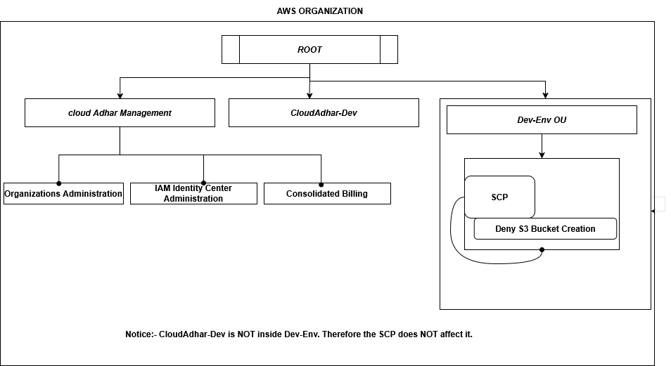
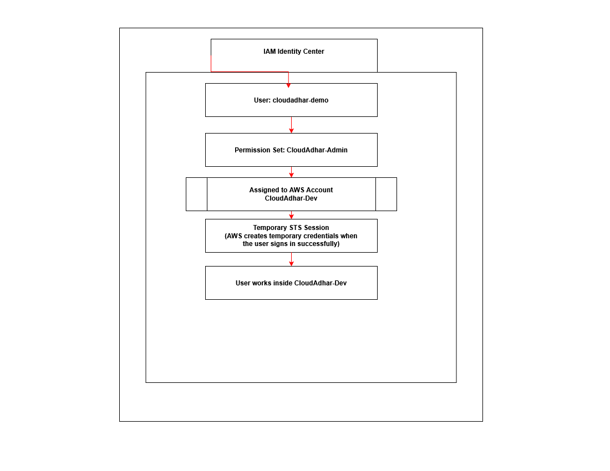
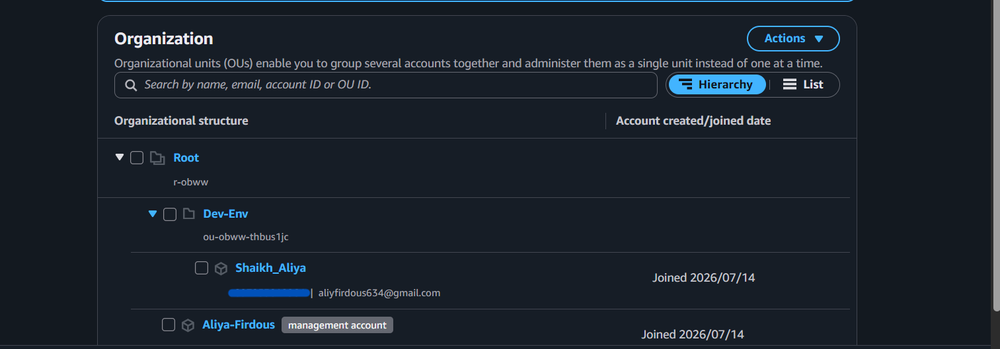
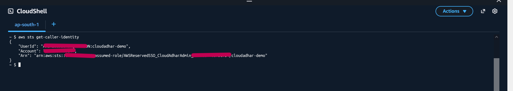
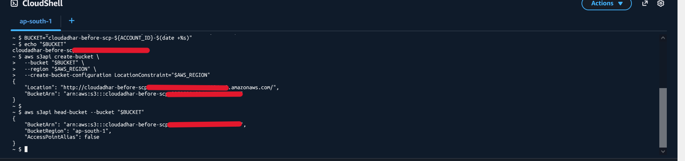
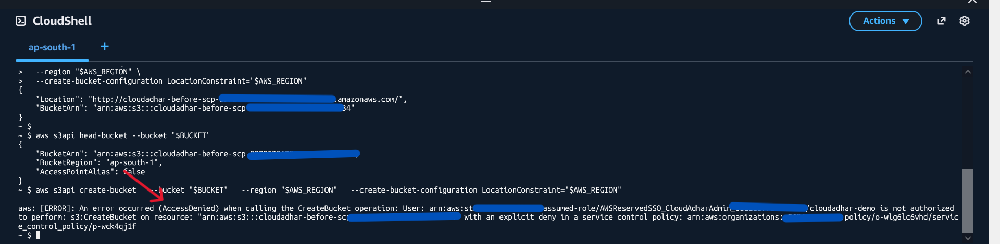

# Week 2 - Day 4: AWS Organizations, IAM Identity Center & Service Control Policies (SCP)

## Name

**Shaikh Aliya Firdous**

---

# Objective

The objective of this lab was to understand how AWS Organizations help manage multiple AWS accounts securely using Organizational Units (OUs), Service Control Policies (SCPs), and IAM Identity Center.

I also learned how Permission Sets and SCPs work together, why IAM Identity Center is preferred over creating IAM users in every account, and how an explicit **Deny** from an SCP overrides an **Allow** permission.

---

# Architecture Diagrams

Before starting the practical lab, I created the following diagrams using **Draw.io** to understand the overall architecture and permission flow.

## 1. AWS Organizations Architecture

This diagram shows the complete multi-account architecture including the Management Account, Member Account, Organizational Unit (OU), IAM Identity Center, Permission Set, and Service Control Policy.

It also compares the problems of using one shared AWS account with the advantages of using multiple AWS accounts.



---

## 2. Permission Flow Diagram

This diagram explains how a user receives permissions through IAM Identity Center and how an SCP can still deny an action even when Administrator permissions are assigned.



---

# Screenshots

## Organization Structure

This screenshot shows the AWS Organization structure including the Management Account, Member Account, Root, Organizational Unit (OU), and attached Service Control Policy.



---

## STS Identity Verification

This screenshot confirms that I successfully logged in through IAM Identity Center and received temporary AWS credentials using AWS STS.



---

## S3 Bucket Creation Before SCP

This screenshot shows that I was able to create an S3 bucket before moving the Dev account into the Organizational Unit.



---

## Access Denied After SCP

This screenshot shows that after moving the Dev account into the Organizational Unit, AWS denied S3 bucket creation because of the attached Service Control Policy.



---

# Practical Steps

## Step 1 - Created a New AWS Account

I first created a second AWS account. This account was later used as my Member Account inside AWS Organizations.

---

## Step 2 - Created an AWS Organization

Using my primary AWS account, I created an AWS Organization.

Then I invited my second AWS account using its Account ID.

After accepting the invitation, both AWS accounts became part of the same AWS Organization.

---

## Step 3 - Created an Organizational Unit (OU)

Inside AWS Organizations, I created an Organizational Unit named:

```
Dev-Env
```

Initially, the OU was empty.

---

## Step 4 - Enabled IAM Identity Center

Before creating any users, I enabled **IAM Identity Center** in the Mumbai (`ap-south-1`) Region.

IAM Identity Center provides one central place to manage users and their access to multiple AWS accounts.

---

## Step 5 - Created a User

Inside IAM Identity Center, I created a user named:

```
cloudadhar-demo
```

AWS sent an activation email.

Using that email, I created a password and configured Multi-Factor Authentication (MFA).

---

## Step 6 - Created a Permission Set

Next, I created a Permission Set named:

```
CloudAdhar-Admin
```

This Permission Set provides Administrator permissions.

A Permission Set defines what actions a user can perform after signing in.

---

## Step 7 - Assigned the User

I assigned:

- User: **cloudadhar-demo**
- Permission Set: **CloudAdhar-Admin**
- AWS Account: **CloudAdhar-Dev**

After the assignment, the user was able to access the Dev account using temporary AWS credentials.

---

## Step 8 - Created a Service Control Policy (SCP)

I created a Service Control Policy named:

```
Deny-S3-Bucket-Creation
```

This policy explicitly denies:

```
s3:CreateBucket
```

I attached the SCP to the **Dev-Env** Organizational Unit.

Since the Dev account was still directly under the Root, the SCP did not affect it yet.

---

## Step 9 - Verified My Identity

After signing in through the AWS Access Portal, I opened CloudShell and executed:

```bash
aws sts get-caller-identity
```

This confirmed that I was working inside the Dev account using temporary credentials generated by AWS STS.

---

## Step 10 - Tested Before Applying the SCP

Before moving the Dev account into the Organizational Unit, I created an S3 bucket.

The bucket was created successfully because the Dev account had not yet inherited the Service Control Policy.

---

## Step 11 - Moved the Member Account

I moved the Dev account from the Root into the **Dev-Env** Organizational Unit.

Once the account became part of the OU, it automatically inherited the attached Service Control Policy.

---

## Step 12 - Tested Again

I tried creating another S3 bucket.

This time AWS returned **AccessDenied** because the Service Control Policy explicitly denied the `s3:CreateBucket` action.

Even though the user had Administrator permissions through the Permission Set, the explicit **Deny** from the SCP took priority.

---

# Concepts Learned

## What is AWS Organizations?

AWS Organizations is a service that allows us to manage multiple AWS accounts from one central place.

Instead of using one AWS account for Development, Testing, Production, Security, and Finance, we can separate them into different AWS accounts.

This improves security, billing, and account management.

---

## What is Root?

The Root is the highest level inside an AWS Organization.

Every Organizational Unit (OU) and every AWS account belongs under the Root.

The Organization Root is different from the AWS Root User.

---

## What is the Management Account?

The Management Account is the primary AWS account that controls the AWS Organization.

It is responsible for:

- Creating the AWS Organization
- Inviting Member Accounts
- Creating Organizational Units (OUs)
- Managing IAM Identity Center
- Attaching Service Control Policies (SCPs)
- Managing consolidated billing

---

## What is a Member Account?

A Member Account is an AWS account that joins the AWS Organization.

Each Member Account can be used for different environments such as Development, Testing, or Production.

In this lab, my second AWS account became the Member Account.

---

## What is an Organizational Unit (OU)?

An Organizational Unit (OU) is like a folder inside AWS Organizations.

It groups AWS accounts together.

Policies attached to an OU automatically apply to every account inside that OU.

In this lab, I created an OU named **Dev-Env**.

---

## Why is an SCP a Guardrail Rather Than a Permission Grant?

A Service Control Policy (SCP) does **not** give permissions to users.

Instead, it acts as a guardrail by defining the maximum permissions available for AWS accounts.

Think of it like this:

- **Permission Set** → Gives permissions to users.
- **SCP** → Sets the maximum limit for AWS accounts.

Even if a user has Administrator permissions, an SCP can still deny specific actions.

---

## Why is IAM Identity Center Preferred Over Creating IAM Users in Every Account?

If we create IAM users separately in every AWS account, we must manage different usernames, passwords, and permissions in every account.

IAM Identity Center provides one central place to manage users and their access to multiple AWS accounts.

Users sign in once and receive temporary AWS credentials instead of permanent IAM user credentials, making access more secure and easier to manage.

---

## Difference Between a Permission Set and an SCP

| Permission Set | Service Control Policy (SCP) |
|----------------|------------------------------|
| Gives permissions to users | Does not give permissions |
| Created in IAM Identity Center | Created in AWS Organizations |
| Applied to users | Applied to AWS Accounts or OUs |
| Defines what a user can do | Defines the maximum actions allowed |
| Can allow actions | Can explicitly deny actions |

---

## Why Did S3 Bucket Creation Work Before Moving the Account?

Before moving the Dev account into the **Dev-Env** Organizational Unit, the attached SCP was not affecting the account.

The **CloudAdhar-Admin** Permission Set allowed me to create an S3 bucket successfully.

---

## Why Did S3 Bucket Creation Fail After Moving the Account?

After moving the Dev account into the **Dev-Env** Organizational Unit, the account inherited the attached Service Control Policy.

The SCP explicitly denied the `s3:CreateBucket` action.

Although the Permission Set allowed Administrator access, AWS always gives higher priority to an explicit **Deny**, so the request failed with **AccessDenied**.

---

## What I Learned About Consolidated Billing

Although I did not explore the Billing console in detail during this lab, I learned that AWS Organizations supports **Consolidated Billing**.

Instead of receiving separate bills for every AWS account, the Management Account receives one combined bill for all Member Accounts.

This makes cost tracking and billing management much easier.

---

# Key Takeaways

During this lab, I learned:

- How to create an AWS Organization.
- How to invite an existing AWS account as a Member Account.
- How Organizational Units (OUs) help organize AWS accounts.
- How IAM Identity Center provides centralized user management.
- How Permission Sets grant permissions to users.
- How Service Control Policies (SCPs) act as guardrails.
- Why an explicit **Deny** always overrides an **Allow** permission.
- How AWS STS provides temporary credentials after signing in through IAM Identity Center.
- How consolidated billing helps manage multiple AWS accounts under one Organization.

---

# Cleanup

After completing the lab, I deleted the test S3 bucket that was created before applying the SCP. I also cleaned up the AWS resources created for this exercise to avoid unnecessary charges.

