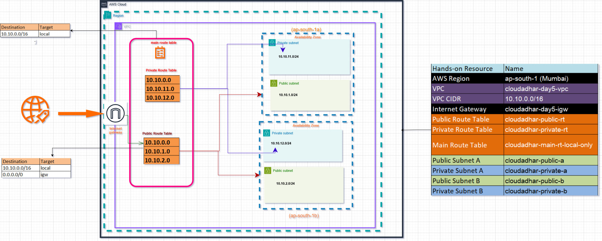
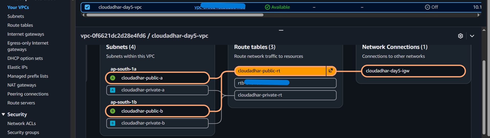
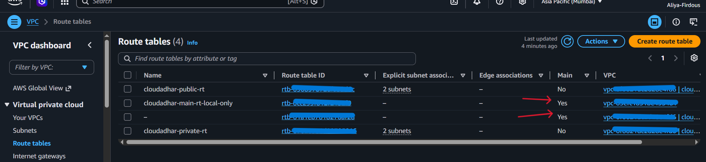

# Week 3 - Amazon VPC (Day 5)

## Name

**Shaikh Aliya Firdous**

---

# Architecture

This project demonstrates the creation of a custom Amazon VPC across two Availability Zones in the Mumbai (`ap-south-1`) Region.

The architecture includes:

- One Custom VPC (`10.10.0.0/16`)
- Four Subnets
  - Public-A
  - Private-A
  - Public-B
  - Private-B
- One Internet Gateway
- One Main Route Table
- One Public Route Table
- One Private Route Table

The public subnets are associated with the Public Route Table, which routes internet traffic through the Internet Gateway. The private subnets are associated with the Private Route Table and have only local routing.

---

## Architecture Diagram



---

# CIDR Plan

| Resource | CIDR |
|----------|------|
| VPC | `10.10.0.0/16` |
| Public Subnet A | `10.10.1.0/24` |
| Private Subnet A | `10.10.11.0/24` |
| Public Subnet B | `10.10.2.0/24` |
| Private Subnet B | `10.10.12.0/24` |

### Address Calculation

### VPC

- CIDR Block: `/16`
- Total IP Addresses: **65,536**

### Each Subnet

- CIDR Block: `/24`
- Total IP Addresses: **256**
- Usable IP Addresses in AWS: **251**
- AWS reserves 5 IP addresses in every subnet.

---

# Public vs Private

A subnet is **public** when:

- It is associated with a Route Table containing:

```
0.0.0.0/0 → Internet Gateway
```

- Auto-assign Public IPv4 is enabled.
- Resources inside the subnet can communicate with the internet.

A subnet is **private** when:

- It has no route to the Internet Gateway.
- Auto-assign Public IPv4 is disabled.
- Resources communicate only within the VPC.

---

# Day 5 Result

Successfully completed:

- ✅ Created a Custom VPC
- ✅ Created four subnets across two Availability Zones
- ✅ Created and attached an Internet Gateway
- ✅ Created Public and Private Route Tables
- ✅ Associated Public and Private Subnets with their Route Tables
- ✅ Verified the VPC Resource Map
- ✅ Verified Route Table configuration

---

## VPC Resource Map



---
## Private Route Table
## Public Route Table



---

# Architecture Decisions

### Why separate Public and Private Subnets?

Public subnets host internet-facing resources, while private subnets are used for internal resources such as databases. This improves security by limiting direct internet access.

### Why use separate Route Tables?

Separate Route Tables allow different routing policies:

- Public Route Table → Internet Gateway
- Private Route Table → Local Route Only

This controls which subnets can access the internet.

---

# Where I Got Stuck

While creating the subnets, I accidentally assigned the same CIDR block (`10.10.1.0/24`) to two different subnets. AWS returned a **CIDR overlap** error. I investigated the subnet addressing plan and corrected the issue by assigning unique CIDR blocks (`10.10.11.0/24` and `10.10.12.0/24`) to the private subnets.

---
# LinkedIn Post

