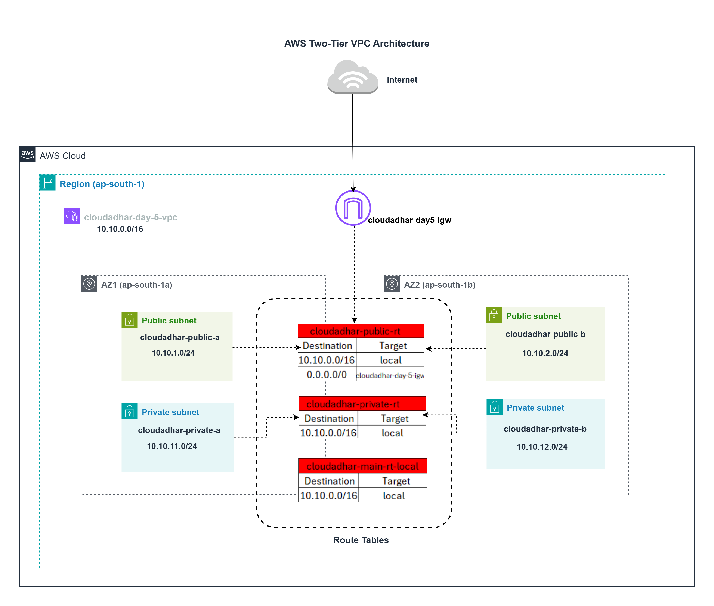
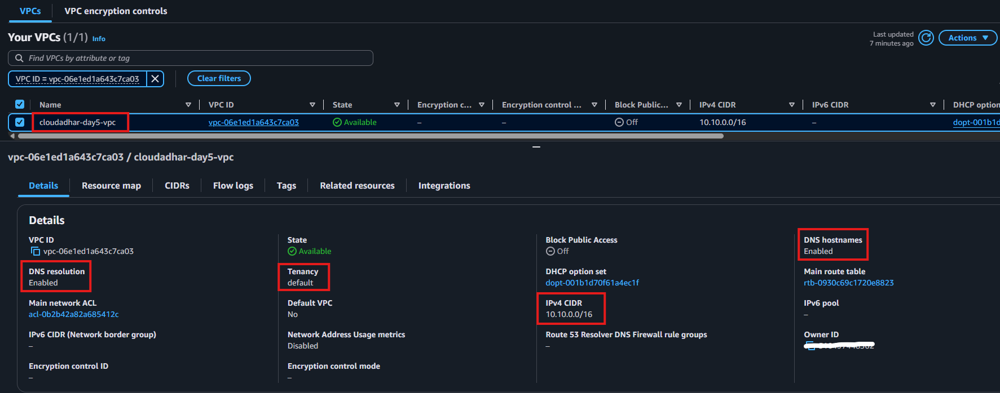
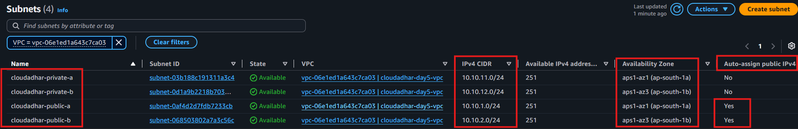
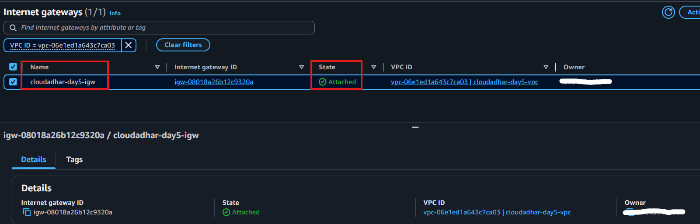
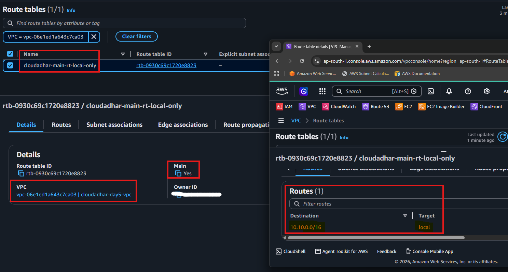
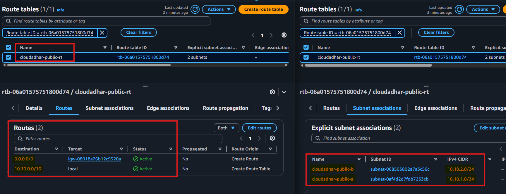
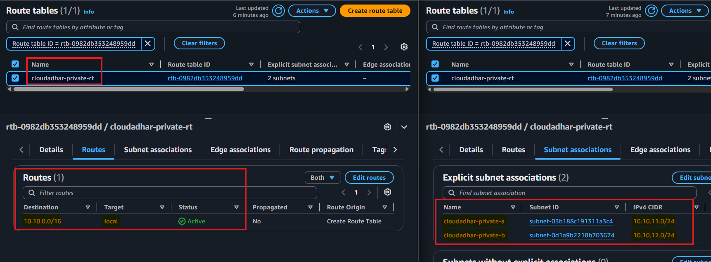
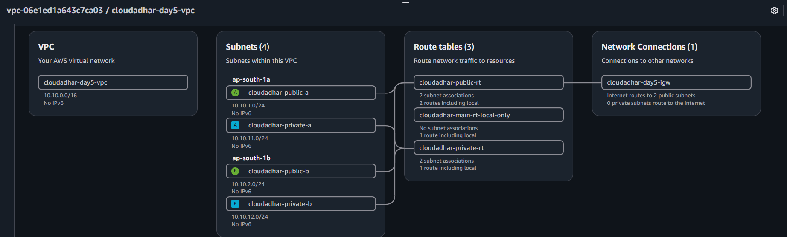

# Week 3 - Amazon VPC

## Name
Sanket Dangat

## Architecture

---

## CIDR Plan

| Resource | CIDR Block | Total Addresses | Usable Addresses |
|---|---|---:|---:|
| VPC | `10.10.0.0/16` | 65,536 | 65,531 |
| Public Subnet A | `10.10.1.0/24` | 256 | 251 |
| Public Subnet B | `10.10.2.0/24` | 256 | 251 |
| Private Subnet A | `10.10.11.0/24` | 256 | 251 |
| Private Subnet B | `10.10.12.0/24` | 256 | 251 |

All subnet CIDR blocks are contained within the VPC CIDR (`10.10.0.0/16`) and do not overlap.

---

## Public vs Private

A subnet is **public** when it:

- Has a default route (`0.0.0.0/0`) pointing to an Internet Gateway (IGW).
- Can automatically assign public IPv4 addresses to instances.
- Provides internet connectivity through the Internet Gateway.

A subnet is **private** when it:

- Does not have a default route to an Internet Gateway.
- Contains only the local route.
- Does not automatically assign public IPv4 addresses.

> A subnet name alone does not make it public or private — the route table decides.

---

## Day 5 Result

Built a two-AZ VPC with public and private subnets, an Internet Gateway, and dedicated route tables.

**Resources created:**

- Custom VPC **`cloudadhar-day5-vpc`** with CIDR block **`10.10.0.0/16`**
- Four subnets across two Availability Zones:
  - `cloudadhar-public-a` (`10.10.1.0/24`) — AZ A
  - `cloudadhar-private-a` (`10.10.11.0/24`) — AZ A
  - `cloudadhar-public-b` (`10.10.2.0/24`) — AZ B
  - `cloudadhar-private-b` (`10.10.12.0/24`) — AZ B
- Internet Gateway **`cloudadhar-day5-igw`** — created and attached to the VPC
- Main route table renamed to **`cloudadhar-main-rt-local-only`** — local route only, no lab subnet associated
- Public route table **`cloudadhar-public-rt`** — `0.0.0.0/0 → IGW`, associated to both public subnets
- Private route table **`cloudadhar-private-rt`** — local route only, associated to both private subnets

**Validation:** Public subnets have internet connectivity through the IGW. Private subnets are isolated from direct internet access.

### 1. VPC Created

---

### 2. Subnets Created

---

### 3. Internet Gateway Attached

---

### 4. Main Route Table

---

### 5. Public Route Table

---

### 6. Private Route Table

---

### 7. AWS VPC Resource Map

---

## Where I Got Stuck

`No blocker`

---

## Cleanup

**Day 5 VPC cleanup (in order):**
1. Disassociated custom route table associations
2. Deleted the four subnets
3. Deleted `cloudadhar-public-rt` and `cloudadhar-private-rt`
4. Detached `cloudadhar-day5-igw` from the VPC
5. Deleted `cloudadhar-day5-igw`
6. Deleted `cloudadhar-day5-vpc`