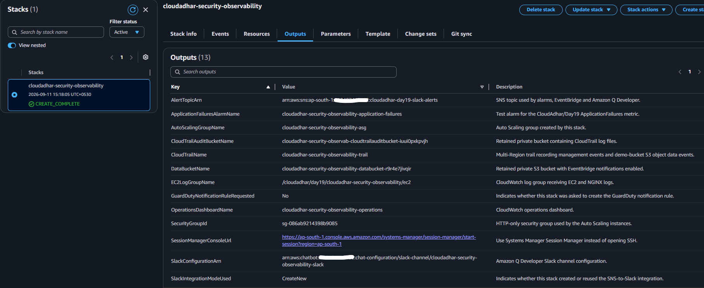
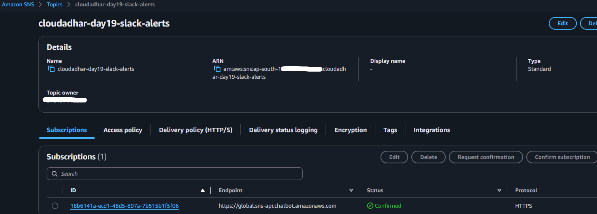
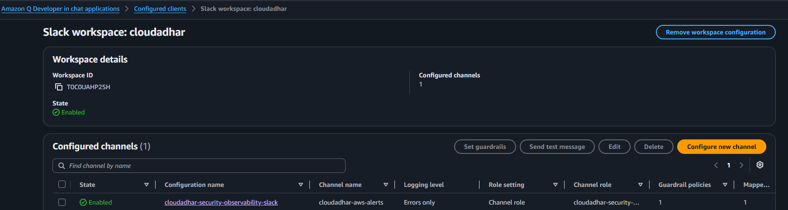
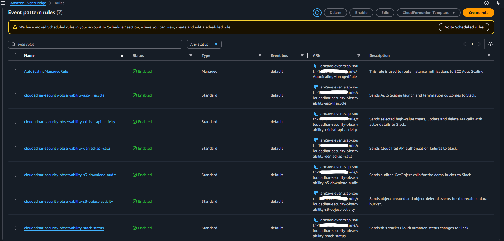
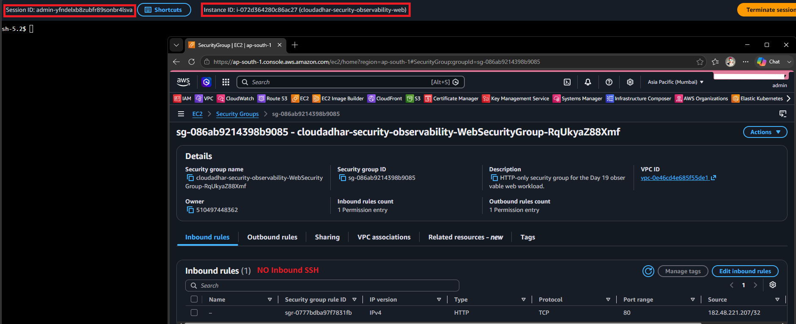
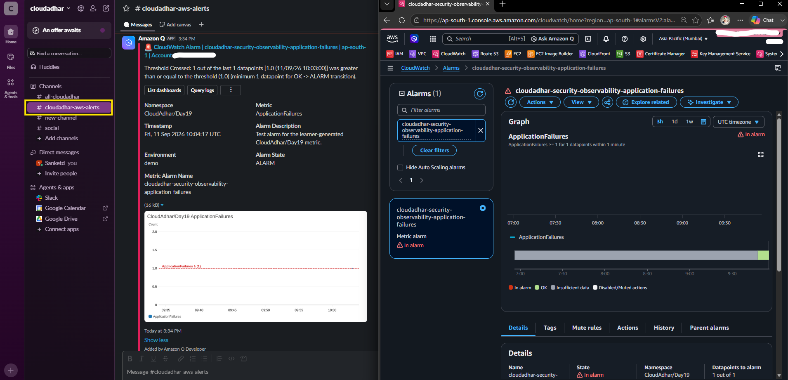
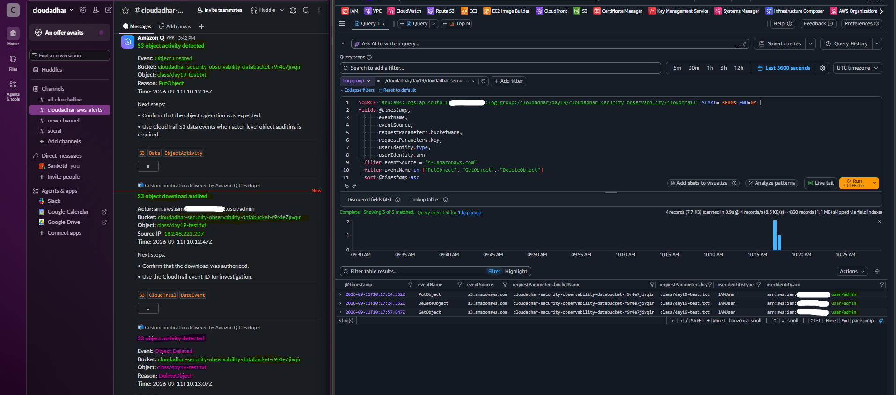

# Week 10 - Day 19 CloudFormation Security and Observability

## Name

Sanket Dangat

## Tasks Completed

- [x] Watched/read the weekly content
- [x] Completed hands-on labs
- [x] Added screenshots or proof
- [ ] Posted on LinkedIn
- [x] Cleaned up AWS resources

# Result

Successfully deployed and validated a CloudFormation-based Security and Observability stack covering CloudFormation, CloudWatch monitoring, S3 activity auditing, CloudTrail data events, EventBridge notifications, SNS notifications, Slack notifications, and secure Session Manager access.

**Resources created:**

- CloudFormation Stack
- Auto Scaling Web Workload
- EC2 Instance and Launch Template
- CloudWatch Logs, Metrics, Alarm and Dashboard
- S3 Buckets for Application Data and CloudTrail Audit Logs
- CloudTrail
- EventBridge Rules
- SNS Notification Topic
- Amazon Q Developer in chat applications Slack Integration
- IAM Roles and Security Groups

**Validation:**

Successfully verified CloudFormation deployment, SNS notification routing, Amazon Q Developer Slack integration, EventBridge event routing, Session Manager access without inbound SSH, custom metric alarm behavior, Slack alarm notifications, S3 object activity, and CloudTrail `PutObject`, `GetObject`, and `DeleteObject` auditing through CloudWatch Logs Insights.

---

### 1. CloudFormation Stack, Resources and Outputs

Deployed the Day 19 infrastructure using the supplied CloudFormation template and verified successful stack creation, deployed resources, and stack outputs.

---

### 2. SNS Notification Topic

Verified the SNS notification topic used to route security and observability notifications to the configured Amazon Q Developer integration.

---

### 3. Amazon Q Developer Slack Integration

Verified the Amazon Q Developer in chat applications integration with the configured Slack channel and confirmed that the notification integration was enabled.

---

### 4. EventBridge Security and Observability Rules

Verified the EventBridge rules used for security and operational notifications, including Auto Scaling lifecycle events, critical API activity, denied API calls, S3 object activity and download auditing, and CloudFormation stack status changes.

---

### 5. Session Manager Access Without Inbound SSH

Successfully connected to the EC2 instance using AWS Systems Manager Session Manager without requiring an inbound SSH rule.

---

### 6. CloudWatch Dashboard, ApplicationFailures Alarm and Slack Notification

Verified the CloudWatch Operations Dashboard and `ApplicationFailures` alarm entering the `ALARM` state. Confirmed that the alarm notification was also delivered to the configured Slack channel through the SNS and Amazon Q integration.

---

### 7. S3 Activity Alerts and CloudTrail Audit

Uploaded, downloaded, and deleted a test object in the S3 bucket. Verified the corresponding Slack notifications and used CloudWatch Logs Insights to query CloudTrail S3 data events for `PutObject`, `GetObject`, and `DeleteObject`.

---

## Where I Got Stuck

`No blocker`

---

## Cleanup

1. Delete the CloudFormation stack `cloudadhar-security-observability`.
2. Verify Day 19 resources such as EC2, ASG, CloudWatch, EventBridge, SNS, and CloudTrail are removed.
3. Empty and delete S3 buckets.
4. Remove Amazon Q/Slack integration workspace..
5. Verify no billable Day 19 resources remain in `ap-south-1`.